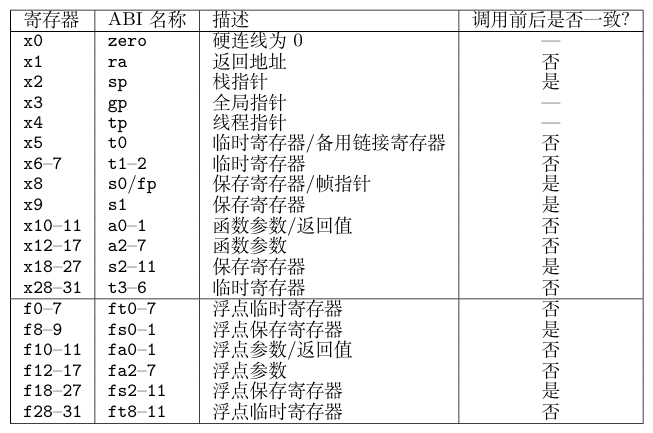
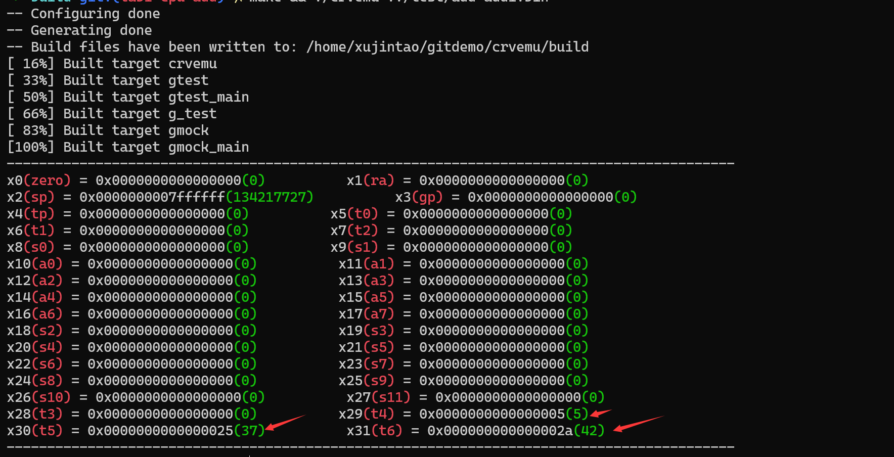
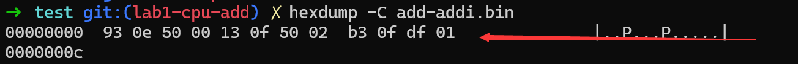

本节实现了一个加法器 CPU，它可以执行两个 RISC-V 指令addi，add,主要流程就是按照状态机的视角描述处理器.


## RISCV寄存器


## 读取文件
详情可见[How to read a file into unsigned char array from std::ifstream?](https://stackoverflow.com/questions/10335236/how-to-read-a-file-into-unsigned-char-array-from-stdifstream)
- 首先是`std::istreambuf_iterator<char>(file)`：

    - 创建了一个 std::istreambuf_iterator<char>，即一个`Input iterator`，用于从 file 流中读取字符，该迭代器从文件流的当前位置开始读取数据，直到文件结束

- `{}`： 使用默认构造的空迭代器 {} 是 C++23 引入的一种新的简便用法，用于表示流的结束

- `std::vector<uint8_t> code` 使用两个迭代器参数（开始迭代器和结束迭代器）构造。这样 code 向量会包含从开始迭代器到结束迭代器之间的所有数据
```cpp
// 用法，将cin换成你使用的流即可
std::vector<unsigned char> vec(
      std::istreambuf_iterator<char>(std::cin)
    , std::istreambuf_iterator<char>()
);

std::vector<uint8_t> code(std::istreambuf_iterator<char>(file), {});
```

## 测试

首先将test目录下的`add-addi.S`汇编转为二进制文件:

```shell
 riscv64-unknown-elf-gcc -Wl,-Ttext=0x0 -nostdlib -march=rv64g -mabi=lp64 -o add-addi add-addi.S
```
- 这里的`-Ttext=0x0`说明可执行文件的第一条指令地址为0,与前面的`pc = 0`符合

- `march=rv64g`指定生成的汇编语言符合`RISC-V ISA`特定的标准。

- `-mabi=ABI-string`：这里的`ABI-string`主要指定`integer types`寄存器的大小和用于浮点类型寄存器的长度，比如这里的`lp64`意味着`long`和`pointer`都是64位的

然后使用`binary` 指定了输出文件格式为纯二进制格式。这意味着输出文件将是没有任何元数据（如段、符号表等）的纯数据文件,生成的`add-addi.bin`只包含指令。
```shell
riscv64-unknown-elf-objcopy -O binary add-addi add-addi.bin
```
然后在build目录下输入：`make && ./crvemu ../test/add-addi.bin`
测试结果如图：



## Debug

关于如何查看`add-addi.bin`中文件的内容:

```shell
hexdump -C add-addi.bin
```
可以发现从0到c，一共三条指令
