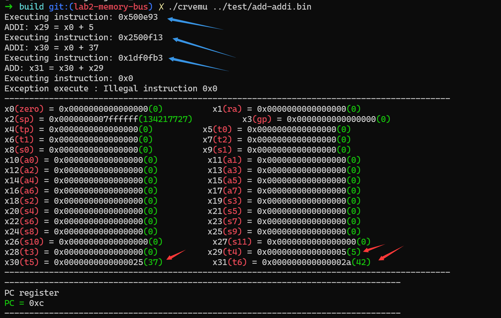
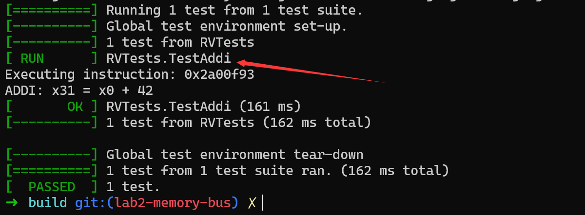

# C++特性

- `constexpr`关键字：
    - 修饰变量的时候，可以把 `constexpr` 对象当作加强版的 `const` 对象：`const` 对象表明值不会改变，但不一定能够在编译期取得结果；`constexpr` 对象不仅值不会改变，而且保证能够在编译期取得结果。如果一个 const 变量能够在编译期求值，将其改为 `constexpr` 能够让代码更清晰易读。
    - `constexpr` 函数可以把运行期计算迁移至编译期，使得程序运行更快（但会增加编译时间）。但如果 `constexpr` 函数中存在无法在编译期求值的参数，则 `constexpr` 函数和普通函数一样在运行时求值，此时的返回值不是常量表达式

- C++中，表示大小或基于内存的索引时通常推荐使用`std::size_t`。这是因为`std::size_t`是一个无符号整数类型，其大小是为了能够安全地表示对象的大小，以及对象最大可能的索引，这样可以增强代码的可移植性和安全性。

- 使用单引号（'）作为数字分隔符，这个特性自 C++14 起被引入

- `std::copy` 是标准库算法，用于复制一个范围内的元素到另一个范围。

- `std::optional<T>`是C++17的新特性，是一个模板类，要么包含一个为T的值，要么包含nothing，即`nullopt`，注意这个不等价于`nullptr`
    - `Nullptr`: an object that can be converted to a value of any pointer type
    - `Nullopt`: an object that can be converted to a value of any optional type
    - 在很多场景下，这种类型特别有用，特别是当函数需要返回一个值，但在某些情况下可能没有合适的值可返回时，比如：

```cpp
#include <iostream>
#include <optional>

std::optional<int> divide(int numerator, int denominator) {
  if (denominator != 0) {
    
    return numerator / denominator;
  } else {
    // 用nullopt处理这种异常情况，更安全
    return std::nullopt;
  }
}

int main() {
  int a = 10;
  int b = 2;

  std::optional<int> result = divide(a, b);

  if (result) {
    std::cout << "Result: " << result.value() << std::endl;
  } else {
    std::cout << "Division by zero occurred." << std::endl;
  }

  result = divide(10, 0);

  if (result) {
    std::cout << "Result: " << result.value() << std::endl;
  } else {
    std::cout << "Division by zero occurred." << std::endl;
  }

  return 0;
}
```

- `[[nodiscard]]` 是 C++17 引入的一个属性，用于指示函数的返回值不应被忽略。当一个函数被标记为 [[nodiscard]]，如果调用该函数但不使用其返回值，编译器将发出警告或错误。这对于那些返回值表示状态、错误或对程序逻辑至关重要的函数特别有用。

- `int system(const char* command);`,是一个用于在 C++ 程序中执行操作系统命令的标准库函数。它的声明在 <cstdlib> 头文件中。该函数的原型如下。
1. 错误状态检查：对于那些返回错误码或状态的函数，使用 `[[nodiscard]]` 可以确保调用者检查这些返回值，从而避免错误被忽视
```cpp
#include <iostream>
#include <vector>

[[nodiscard]] bool insertIntoDatabase(const std::vector<int>& data) {
    if (data.empty()) {
        std::cerr << "Error: Data is empty." << std::endl;
        return false;
    }
    // 插入数据到数据库...
    return true;
}

int main() {
    std::vector<int> myData;

    // 假设忽略了函数返回值
    insertIntoDatabase(myData); // 编译器将发出警告

    // 正确的做法
    if (!insertIntoDatabase(myData)) {
        // 处理错误
    }

    return 0;
}
```

2. 重要的返回值
```cpp
#include <memory>

class MyClass {};

[[nodiscard]] std::unique_ptr<MyClass> createMyClass() {
    return std::make_unique<MyClass>();
}

int main() {
    createMyClass(); // 这将导致编译器警告，因为创建的对象没有被使用

    auto myObject = createMyClass(); // 正确使用

    return 0;
}
```

## 测试结果



## 集成测试框架

首先是在测试框架中将之前需要手动编译执行得到的二进制指令文件通过函数包装

```cpp
void generate_rv_assembly(const std::string& c_src) {}

void generate_rv_obj(const std::string& assembly) {}

void generate_rv_binary(const std::string& obj) { }
```

然后就是每次根据不同的测试用例初始胡不同的CPU，需要需要一个`rv_helper()`函数

```cpp
// 生成测试用的Cpu实例，code是测试指令，test_name是测试用例名称，n_clock是周期数
// 比如 code = "addi x31, x0, 0" test_name = "test-addi"
Cpu rv_helper(const std::string &code, const std::string &test_name,
              size_t n_clock) {
```

然后就是编写测试用例，这里的code是实际的指令，`test-addi`是测试名称，测试过程中好像不会生成具体的文件，具体原因未知
```cpp
// Test addi instruction
TEST(RVTests, TestAddi) {
    std::string code = start + "addi x31, x0, 42 \n";
    Cpu cpu = rv_helper(code, "test_addi", 1);
    EXPECT_EQ(cpu.regs[31], 42)
        << "Error: x31 should be 42 after ADDI instruction";
}
```

由于在`g_test.cc`文件中引用了`cpu.hh`中定义的函数，所以在构建测试可执行文件`g_test`时需要链接`common_library`

```cmake
# 将 GTest::gtest_main 库链接到 g_test 可执行文件中。GTest::gtest_main 是 Google Test 提供的一个目标，包含了主测试入口
# 由于使用了rv_helper，所以同样需要链接common_library
target_link_libraries(
        g_test
        common_library
        GTest::gtest_main
)
```
测试结果如图：
